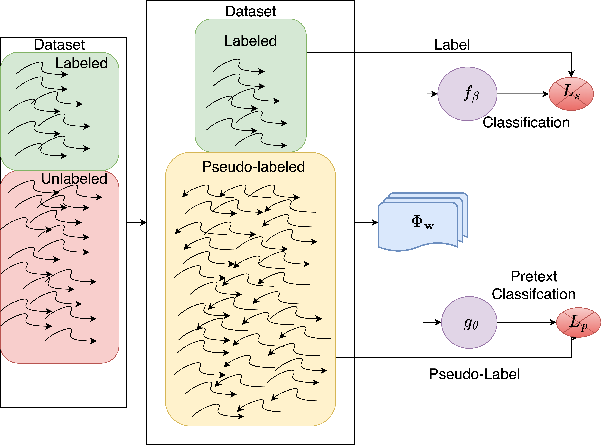

# InverseTime

_InverseTime: A self-supervised technique for semi-supervised classification of time series_

## Graphical Abstract

InverseTime: First we have the dataset with some labeled data. Then, the dataset is transformed by inverting all the series and assigning the pseudo-label 1 to the series in the original order and 0 to the inverted ones. Finally, a convolutional network layer is trained to solve the two tasks.

## Overview
InverseTime is a method designed to leverage self-supervision for the semi-supervised classification of time series data. By creating pseudo-labels through time inversion, it allows a convolutional neural network to learn from both labeled and unlabeled data effectively.

## Runing Example

```
 python inverse_time.py -p CricketY 0.8 4l
```
Where 0.8 is the unlabel porcentage and CricketY is dataset

## Authors ✒️


* **Manuel Alejandro Goyo**
* **Ricardo Ñanculef**
* **Carlos Valle** 
